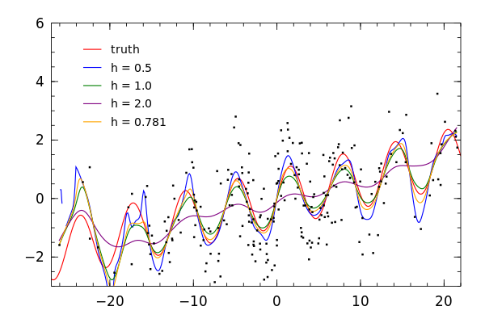

# KernSmooth

[](https://travis-ci.org/lendle/KernSmooth.jl)

[](https://github.com/IainNZ/PackageEvaluator.jl)

## About

KernSmooth.jl is the a partial port of the R package [KernSmooth](http://cran.r-project.org/web/packages/KernSmooth/index.html), (v2.23-10.)
The R package carries an unlimited license.

Currently the `locpoly` and `dpill` functions are ported.
`locpoly` uses local polynomials to estimate pdf of a single variable or a regression function for two variables, or their derivatives.
`dpill` provides a method to select a bandwidth for local linear regression.

Other functionality provided by the R package but not ported to KernSmooth.jl pertains to univariate and bivariate kernel density estimation.
Univariate and bivariate kernel density estimation is provided by the `kde` function in [StatsBase.jl](https://github.com/JuliaStats/StatsBase.jl/).

## Usage

### `locpoly` - Estimate regression or density functions or their derivatives using local polynomials

The method signatures:
```julia
locpoly(x::Vector{Float64}, y::Vector{Float64}, bandwidth::Union(Float64, Vector{Float64});
    drv::Int = 0,
    degree::Int=drv+1,
    kernel::Symbol = :normal,
    gridsize::Int = 401,
    bwdisc::Int = 25,
    range_x::Vector{Float64}=Float64[],
    binned::Bool = false,
    truncate::Bool = true)

locpoly(x::Vector{Float64}, bandwidth::Union(Float64, Vector{Float64}); args...)
```

* `x` - vector of x data
* `y` - vector of y data. For density estimation (of `x`), `y` should be omitted or be an empty `Vector{T}`
* `bandwidth` - should be a scalar or vector of length `gridsize`
* Other arguments are optional. For their descriptions, see the [R documentation](https://stat.ethz.ch/R-manual/R-devel/library/KernSmooth/html/locpoly.html)

A `(Vector{Float64}, Vector{Float64})` is returned.  The first vector is the sorted set of points at which an estimate was computed. The estimates are in the second vector.

### `dpill` - Direct plug-in method to select a bandwidth for local linear Gaussian kernel regression

The method signature
```julia
function dpill(x::Vector{Float64}, y::Vector{Float64};
               blockmax::Int = 5,
               divisor::Int = 20,
               trim::Float64 = 0.01,
               proptrun::Float64 = 0.05,
               gridsize::Int = 401,
               range_x::Vector{Float64} = Float64[],
               truncate = true)
```
* `x` - vector of x data
* `y` - vector of y data.
* Other arguments are optional. For their descriptions, see the [R documentation](https://stat.ethz.ch/R-manual/R-devel/library/KernSmooth/html/dpill.html)

## Regression example

Estimate regression using different bandwidths, including the bandwidth selected by `dpill`.

```julia
xgrid2, yhat0_5 = locpoly(x, y, 0.5)
yhat1_0 = locpoly(x, y, 1.0)[2]
yhat2_0 = locpoly(x, y, 2.0)[2]
h = dpill(x, y)
yhath = locpoly(x, y, h)[2]
```
<!-- file("scatter.png", height=400, width=600) -->
A plot of the estimates and true regression:



The full code for the example is [here](http://nbviewer.ipython.org/gist/lendle/9314892).

